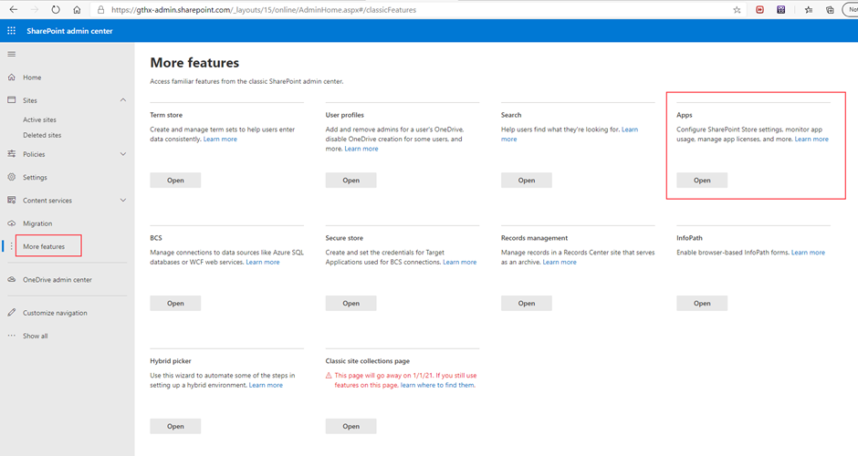
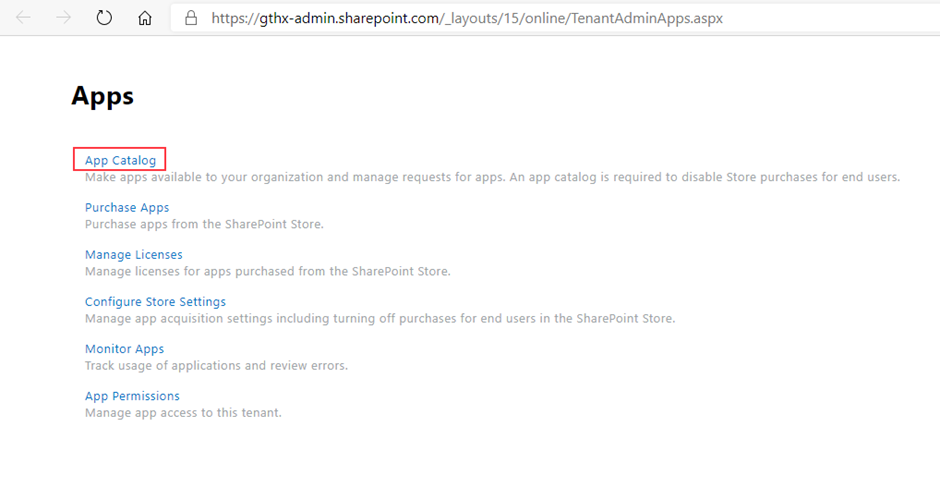
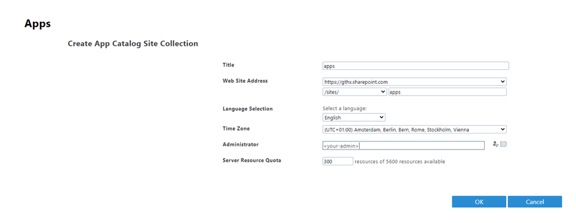
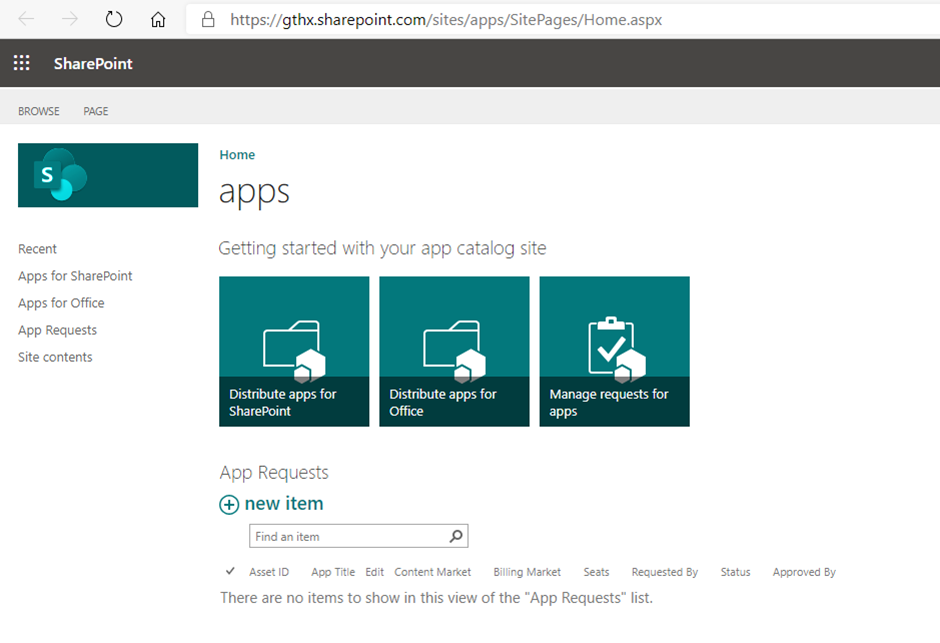
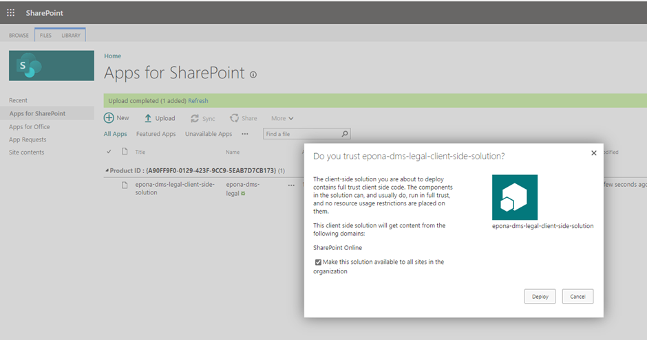
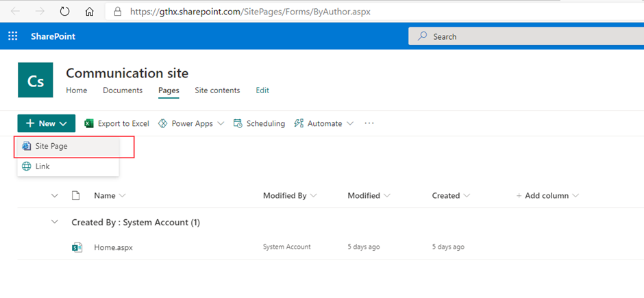
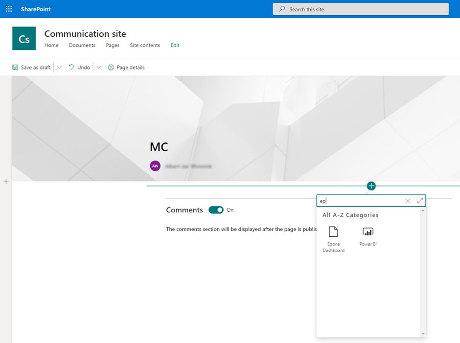
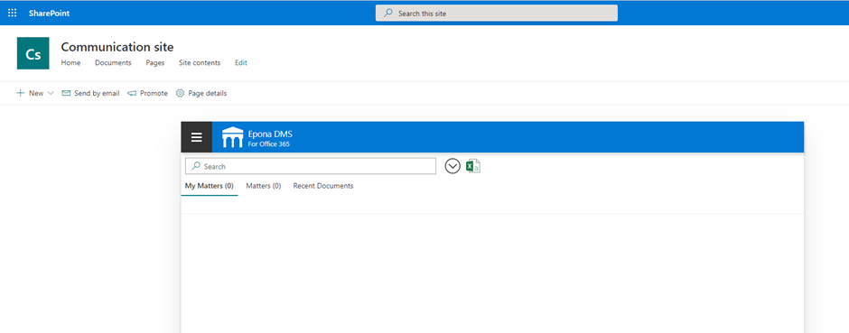
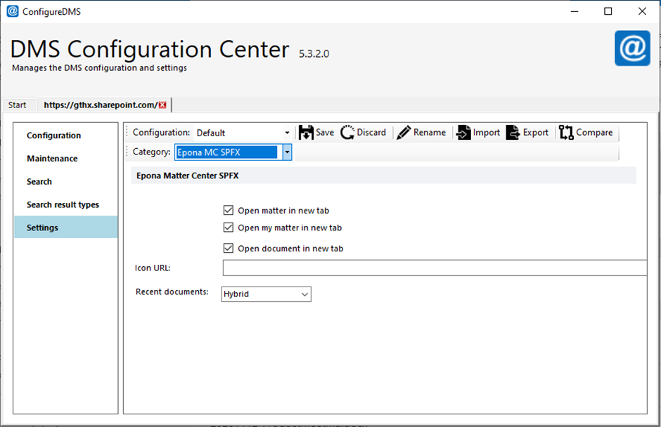
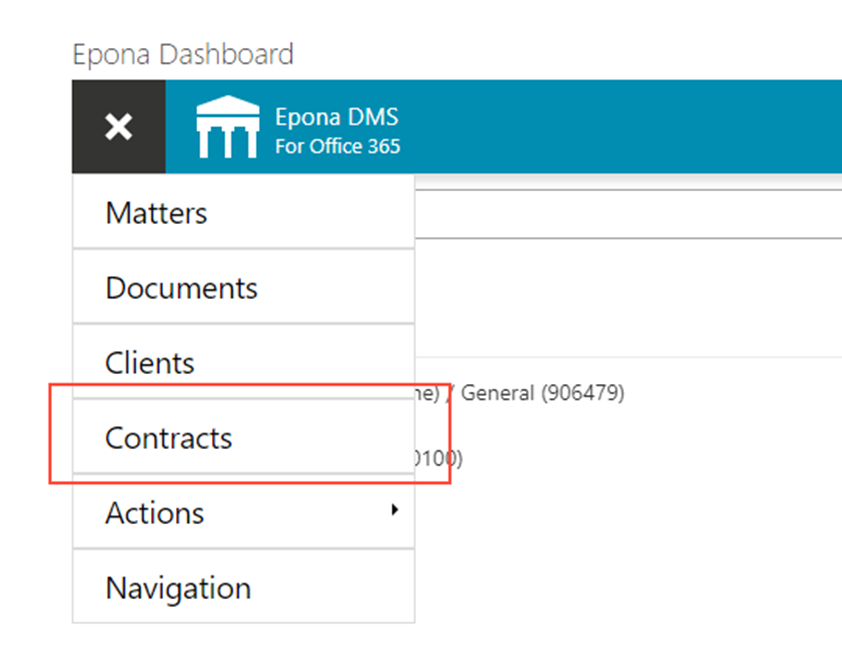

# Installation of Epona Matter Center SPFX

Epona MC SPFX is a SharePoint hosted app following the modern Office365 SPFX technique. Like all Office SPFX apps, it resides in a SharePoint app catalog. When published, Epona MC SPFX can be added to any SharePoint page in the DMSForLegal site collection.

Like other parts of DMSforLegal the configuration settings are stored in the DMS Configuration list. However, for the default layout, no extra settings are needed in DMS Configuration.

## App catalog

An app catalog should only be created once in an SharePoint environment. For an existing tentant, this might already be there, otherwise it should be installed using the SP admin interface.

1. Open the \&lt;domain\&gt;-admin.sharepoint.com, navigate to &#39;More features&#39; and open &#39;Apps&#39;

 

2. Select &#39;App catalog&#39;

 

3. Leave &#39;Create a new app catalog site&#39; selected and click &#39;OK&#39;

 

4. Fill in the form. The name &#39;apps&#39; for the catalog is most often used. After submitting the form the apps catalog will be created. This can take several minutes.
 
 

5. After submitting the form the apps catalog will be created. This can take several minutes.

## Install or update the SPFX app.

At the time of writing required package file can be retrieved from [https://docscorpepona.sharepoint.com/Solution/Forms/AllItems.aspx](https://docscorpepona.sharepoint.com/Solution/Forms/AllItems.aspx). Please make sure to get the latest version of the epona-dms-legal.sppkg file.

1. Get a local copy of epona-dms-legal.sppkg.
2. Navigate to the app catalog site and select &#39;Distribute apps for SharePoint&#39;

 

3. Either select &#39;Upload&#39;, or just drag the .sppkg fileto this page

 

4. Select &#39;Make this solution available to all sites in the organization&#39; and click &#39;Deploy&#39; 
5. The app is now available for users to be added to a SharePoint page.

## Default installation on SharePoint page

1. Navigate to the Site Pages folder of the DMSforLegal site collection, and select &#39;New&#39;, &#39;Site Page&#39;

 

2. Give the page the name &#39;MC&#39;, and click &#39;+&#39; to add a webpart. When typing &#39;ep&#39;, the &#39;Epona Dashboard&#39;
 
 

3. Select the &#39;Epona Dashboard&#39; app, and publish the page. The app will become visible, including matters, my maters etc., if present.

 

4. Settings can be changed using the DMS Configuration List. Special attention should be given to the Matters and Clients AddFields and EditFields settings for the &#39;Code&#39; field. These should be either set to &#39;View&#39; or &#39;Hidden&#39; if the value is provided by another process, for example by the Provisioning service.

 

5. A few other settings can be configured using DMS Configuration Center

 
 

## Contract feature

The contract feature extension for Epona MC SPFx can now be installed using the DMS Configuration tool. Once the feature has been enabled using the settings, a new option appears that allows it to install in EponaMC SPFx and be available from the menu.

It adds some settings to the DMS Configuration List (SPF category), that can of couse be changed manually afterwards.

