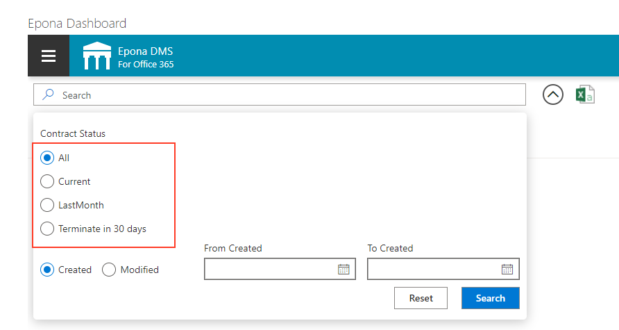

<h1>Epona Matter Center SPFx configuration</h1>

Epona MC can be confugured by settings in DMS Congiguration.The defaults for all the lists, forms and filters are defined within the app, so the works without additional settings. Only when a customer wants to have something changed, like the title of the Matter column, the columns that are displayed etc. items should be added to the DMS Configuration list to overrule the default.

<h2>General syntax</h2>
Items added for the Epona MC SPFx app should all have 'SPF' in the Category field. The Title field contains the key for the setting. he key constsist, like for the DMSforLegal settings, of a a more or less hierargical structure of words, each separated by a dot. The value field contains the actual setting, and the desciption is only used as documentation.

<h2>A few common settings</h2>
There are a few common settings that, for most of them, can also be set by the DMS Configuration tool (The tool only adds them when the chosen value differs from the default setting).
<table>
     <tr>
        <td>
        Title
        </td>
       <td>
        Category
        </td>
       <td>
        Value
        </td>
       <td>
       Description
        </td>
    </tr>
       <tr>
        <td>
        Settings.DocumentPreview.OpenDocumentInNewTab
        </td>
       <td>
        SPF
        </td>
       <td>
        yes
        </td>
       <td>
       yes/no
        </td>
    </tr>
    <tr>
        <td>
        Settings.Matter.OpenMatterInNewTab
        </td>
       <td>
        SPF
        </td>
       <td>
        yes
        </td>
       <td>
       yes/no
        </td>
    </tr>
   <tr>
        <td>
        Settings.MatterCenter.IconURL
        </td>
       <td>
        SPF
        </td>
       <td>
        </td>
       <td>
       Icon size 40*40.
        </td>
    </tr>
   <tr>
        <td>
        Settings.MyMatter.OpenMatterInNewTab
        </td>
       <td>
        SPF
        </td>
       <td>
        yes
        </td>
       <td>
       yes/no
        </td>
    </tr>
   <tr>
        <td>
        Settings.RecentDocuments.SearchType
        </td>
       <td>
        SPF
        </td>
       <td>
        Hybrid
        </td>
       <td>
       Hybrid/SharePoint/List
        </td>
    </tr>
   <tr>
        <td>
        Settings.HeaderBackgroundColor
        </td>
       <td>
        SPF
        </td>
       <td>
        skyblue
        </td>
       <td>
       Rgb, hexacode, or simple color names 
        </td>
    </tr>
    </table>

<h2>General language elements</h2>
Text within the app can be customized by adding a listitem in DMS Configuration with the correct key and the adapted text as a value. All of these keys starts with 'Language.', followed by a part that indicates which text to change. For example the key 'Language.Loading' can be used to change the 'Loading ...' text used by the app. The list of Language codes can be found in attachment 1.

In general, the texts displayed to identify a field, like the column headers for the diffferent tables, are not defined by the 'Language.' code, but by the filed definition structure (see below). The same is true for the items in the hamburger menu, which is highly customizable.

<h2>Field definition syntax</h2>
To define extra fields for de different tables, the advanced search panels or the forms to add or edit list items a consistent key structure is used. See for example the keys below
<table>
<tr><td>Matters.ViewFields.Editor_Title.DisplayName</td></tr>
<tr><td>Matters.ViewFields.Editor_Title.ManagedProperty</td></tr>
<tr><td>Matters.ViewFields.Editor_Title.Order</td></tr>
<tr><td>Matters.ViewFields.Editor_Title.SharePointName</td></tr>
<tr><td>Matters.ViewFields.Editor_Title.Type</td></tr>
<tr><td>Matters.ViewFields.Editor_Title.Width</td></tr>
</table>

These keys all start with the actual list to use. The second part indicates where the key should be used, in this case the table that shows the records. Other values for this part could be 'SearchFields', to configure something in the advanced search filter of the list, or 'EditFields' to change the Edit form for the item.

The third part can be chosen by the admin, and acts as a key within a key, so that the app knows which keys are for the same field.

The fourth part of the keys are largely shared amongst their usage cases, although some, like 'Width' are only useful for ViewFields.

<h2>Menu and tab definition syntax</h2>

The keys and values below define a new menu item in the Hamburger menu at the 4th location (Order starting at 0)

  <table>
      <tr>
        <td>
        Title
        </td>
       <td>
        Category
        </td>
       <td>
        Value
        </td>
       <td>
       Description
        </td>
    </tr>
   <tr>
        <td>
        Navigation.Contracts.DefaultActionName
        </td>
       <td>
        SPF
        </td>
       <td>
        Contracts
        </td>
       <td>
      -
        </td>
    </tr>
   <tr>
        <td>
        Navigation.Contracts.DisplayName
        </td>
       <td>
        SPF
        </td>
       <td>
        Contracts
        </td>
       <td>
       -
        </td>
    </tr>   <tr>
        <td>
        Navigation.Contracts.Order
        </td>
       <td>
        SPF
        </td>
       <td>
        3
        </td>
       <td>
       - 
        </td>
    </tr>
     <tr>
        <td>
        Navigation.Contracts.UniqueName
        </td>
       <td>
        SPF
        </td>
       <td>
        Contracts
        </td>
       <td>
       -
        </td>
    </tr>
    </table>

Of couse the menu item actually doesn't do anything yet when chosen. It needs at least one list tab defined to indicate what should happen. The keys below show how this can be done.

<table>
      <tr>
        <td>
        Title
        </td>
       <td>
        Category
        </td>
       <td>
        Value
        </td>
       <td>
       Description
        </td>
    </tr>
   <tr>
        <td>
   Navigation.Tab.Contracts.ActionName
     </td>
       <td>
        SPF
        </td>
       <td>
        Contracts
        </td>
       <td>
      -
        </td>
    </tr>
    <tr>
        <td>
Navigation.Tab.Contracts.DisplayName
       </td>
       <td>
        SPF
        </td>
       <td>
        Contracts
        </td>
       <td>
       -
        </td>
    </tr>
    <tr>
        <td>
Navigation.Tab.Contracts.Filter
        </td>
       <td>
        SPF
        </td>
       <td>
        ContentType:"DMS Contracttype"
        </td>
       <td>
       Any keyword query that works
        </td>
    </tr>
    <tr>
        <td>
  Navigation.Tab.Contracts.Order
        </td>
       <td>
        SPF
        </td>
       <td>
        0
        </td>
       <td>
       Order of the tabs
        </td>
    </tr>
    <tr>
        <td>
    Navigation.Tab.Contracts.Parent
        </td>
       <td>
        SPF
        </td>
       <td>
        Contracts
        </td>
       <td>
       Action unique name as specified in the hamburger menu
        </td>
    </tr>
    <tr>
        <td>
Navigation.Tab.Contracts.QueryString
        </td>
       <td>
        SPF
        </td>
       <td>
        allcontracts
        </td>
       <td>
       -
        </td>
    </tr>
    <tr>
        <td>
Navigation.Tab.Contracts.Type
        </td>
       <td>
        SPF
        </td>
       <td>
        SharePoint
        </td>
       <td>
       SharePoint/List/Hybrid/DocumentList/Add
        </td>
    </tr>
</table>

Because the 'Type' is specified as 'SharePoint', the 'Filter' can be implemented as anything that also works in the SharePoint search field. Because some fields like the logged-in user or current date are dynamic, special functions can be used within these filter strings:

<table>
    <tr>
        <td>
            Function
        </td>
        <td>
            Description
        </td>
        <td>
            Example
        </td>
    </tr>
   <tr>
        <td>
            today, yesterday, this week, last week, this month, last monh, this year, last year
        </td>
        <td>
            The period for a date to be in
        </td>
        <td>
            -
        </td>
    </tr>
  <tr>
        <td>
            @Today(n), @Month(n), @Year(n)
        </td>
        <td>
            A date n periods from today
        </td>
        <td>
            ModifiedDate>@Month(-2) and ModifiedDate<=@Month(-1)
        </td>
    </tr>
  <tr>
        <td>
            [Me]
        </td>
        <td>
            The currently logged-in user
        </td>
        <td>
            Author = [Me]
        </td>
    </tr>
</table>

All items that can be diplayed will also need a definition for the columns that should be presented. However if one of the previous defined listview definitions is suitable, a former definition can be used by 'ReuseViewActionName', like in the example below:

<table>
    <tr>
        <td>
            Title
        </td>
        <td>
            Category
        </td>
        <td>
            Value
        </td>
        <td>
            Descriptopn
        </td>
    </tr>
   <tr>
        <td>
            Navigation.Tab.AllTasks1.ReuseViewActionName
        </td>
        <td>
            SPF   
        </td>
        <td>
            AllTasks    
        </td>
        <td>
            -
        </td>
    </tr>
</table>

<h2>Special purpose advanced filter</h2>

The advanced filter for a list can be augmented by adding special purpose selections. The end user can select one of these special purpose filters by selecting the corresponding radiobutton. Because these filters work in conjunction with the other filter settings it is often good to include a radiobutton that has an empty filter:

<table>
    <tr>
        <td>
        Title
        </td>
       <td>
        Category
        </td>
       <td>
        Value
        </td>
       <td>
       Description
        </td>
    </tr>
    <tr>
        <td>
            Contracts.SearchFields.CFContractEndDate.DisplayName
        </td>
       <td>
            SPF
        </td>
       <td>
            Contract Status
        </td>
       <td>
      -
        </td>
    </tr>
    <tr>
        <td>
            Contracts.SearchFields.CFContractEndDate.Options.All.DisplayName
        </td>
       <td>
            SPF
        </td>
       <td>
            All
        </td>
       <td>
      -
        </td>
    </tr>
    <tr>
        <td>
            Contracts.SearchFields.CFContractEndDate.Options.All.Filter
        </td>
       <td>
            SPF
        </td>
       <td></td>
       <td>
      -
        </td>
    </tr>
    <tr>
        <td>
            Contracts.SearchFields.CFContractEndDate.Options.All.Order
        </td>
       <td>
            SPF
        </td>
       <td>
            0
        </td>
       <td>
      -
        </td>
    </tr>
    <tr>
        <td>
            Contracts.SearchFields.CFContractEndDate.Options.All.UniqueName
        </td>
       <td>
            SPF
        </td>
       <td>
            All
        </td>
       <td>
      -
        </td>
    </tr>
</table>

Then of course one can add lines to include specific filters, like below:

<table>
    <tr>
        <td>
        Title
        </td>
       <td>
        Category
        </td>
       <td>
        Value
        </td>
       <td>
       Description
        </td>
    </tr>
    <tr>
        <td>
            Contracts.SearchFields.CFContractEndDate.Options.TerminateIn30Days.DisplayName
        </td>
       <td>
            SPF
        </td>
       <td>
            Terminate in 30 days
        </td>
       <td>
      -
        </td>
    </tr>
    <tr>
        <td>
            Contracts.SearchFields.CFContractEndDate.Options.TerminateIn30Days.Filter
        </td>
       <td>
            SPF
        </td>
       <td>
            CFContractEndDate>@Today(0) AND CFContractEndDate<=@Today(30)
        </td>
       <td>
      -
        </td>
    </tr>
    <tr>
        <td>
            Contracts.SearchFields.CFContractEndDate.Options.TerminateIn30Days.Order
        </td>
       <td>
            SPF
        </td>
       <td>
            1
        </td>
       <td>
      -
        </td>
    </tr>
    <tr>
        <td>
            Contracts.SearchFields.CFContractEndDate.Options.TerminateIn30Days.UniqueName
        </td>
       <td>
            SPF
        </td>
       <td>
            TerminateIn30Days
        </td>
       <td>
      -
        </td>
    </tr>
</table>

